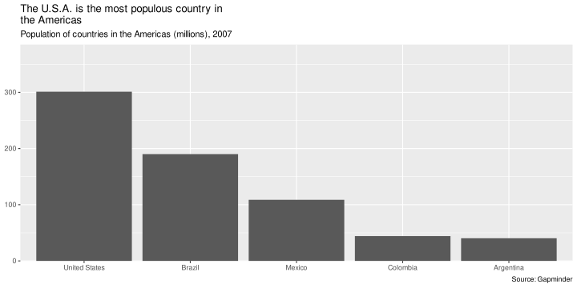
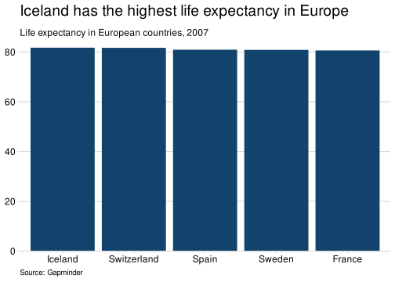

<!-- README.md is generated from README.Rmd. Please edit that file -->

# afcharts 

<!-- badges: start -->

[](https://github.com/best-practice-and-impact/afcharts/releases/latest)
[](https://github.com/best-practice-and-impact/afcharts/actions)

<!-- badges: end -->

afcharts is an R package for creating accessible plots by the Government
Analysis Function. Currently, functions are available for styling
ggplot2 plots.

The package has been developed using the [Government Analysis Function
Data Visualisation
guidance](https://analysisfunction.civilservice.gov.uk/policy-store/data-visualisation-charts/).
afcharts should be used in conjunction with these guidance documents.

More information about the package and its functions can be found on the
[afcharts website](https://best-practice-and-impact.github.io/afcharts).
In particular, the
[cookbook](https://best-practice-and-impact.github.io/afcharts/articles/cookbook.html)
contains lots of examples.

## Installation

afcharts can be installed directly from GitHub.

``` r
remotes::install_github(
  "best-practice-and-impact/afcharts",
  upgrade = "never",
  build_vignettes = TRUE
)
```

## Getting Started

Once installed, afcharts can be loaded using the `library()` function:

``` r
library(afcharts)
```

Help files for each function in the package can be found on the
[References](https://best-practice-and-impact.github.io/afcharts/reference)
page of the package website. Alternatively, type `?function_name` into
the RStudio console. For example:

``` r
?theme_af()
```

### Use afcharts as default

The easiest way to use afcharts is by adding `use_afcharts()` to the
beginning of your R script, Rmarkdown document or Shiny app code. This
function will set a number of defaults to ggplot2 geoms, use afcharts
colour palettes and use `theme_af()`.

#### Example 1: Plot with one colour using ggplot2 defaults

``` r
library(ggplot2)
library(dplyr)
library(gapminder)
library(afcharts)

gapminder |> 
  filter(year == 2007 & continent == "Europe") |>
  slice_max(order_by = lifeExp, n = 5) |>
  ggplot() +
  geom_col(aes(x = reorder(country, -lifeExp), y = lifeExp)) +
  scale_y_continuous(expand = c(0, 0)) +
  labs(
    x = NULL,
    y = NULL,
    title = "Iceland has the highest life expectancy in Europe",
    subtitle = "Life expectancy in European countries, 2007",
    caption = "Source: Gapminder"
  )
```



#### Example 2: Plot with one colour using afcharts defaults

``` r
afcharts::use_afcharts()

gapminder |> 
  filter(year == 2007 & continent == "Europe") |>
  slice_max(order_by = lifeExp, n = 5) |>
  ggplot() +
  geom_col(aes(x = reorder(country, -lifeExp), y = lifeExp)) +
  scale_y_continuous(expand = c(0, 0)) +
  labs(
    x = NULL,
    y = NULL,
    title = "Iceland has the highest life expectancy in Europe",
    subtitle = "Life expectancy in European countries, 2007",
    caption = "Source: Gapminder"
  )
```



**Note on use of titles, subtitles and captions** <br> Titles, subtitles
and captions have been embedded in these example charts for
demonstration purposes. However, for accessibility reasons, it is
usually preferable to provide titles in the body of the page rather than
embedded within the image of the plot. More information is available in
the [accessibility
article](https://best-practice-and-impact.github.io/afcharts/articles/accessibility.html#other-accessibility-considerations).

## Acknowledgments

The afcharts package is based on the
[sgplot](https://scotgovanalysis.github.io/sgplot/index.html) package,
written by Alice Hannah.

## Licence

Unless stated otherwise, the codebase is released under [the MIT
License](LICENSE). This covers both the codebase and any sample code in
the documentation.

The documentation is [© Crown
copyright](http://www.nationalarchives.gov.uk/information-management/re-using-public-sector-information/uk-government-licensing-framework/crown-copyright/)
and available under the terms of the [Open Government
3.0](http://www.nationalarchives.gov.uk/doc/open-government-licence/version/3/)
licence.
