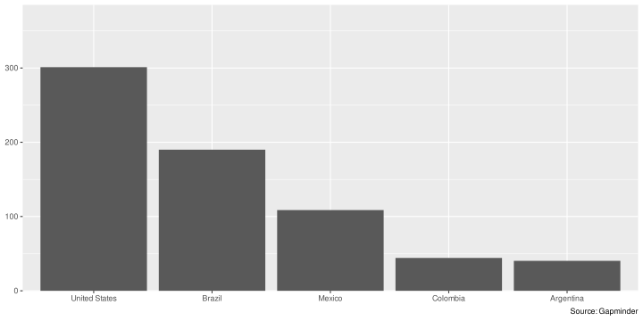
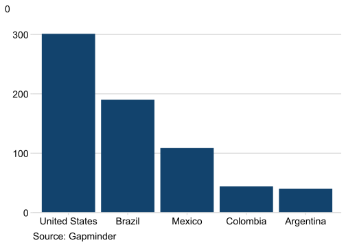
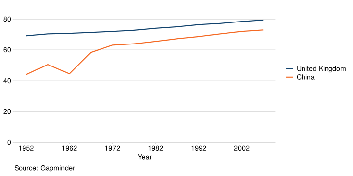

<!-- README.md is generated from README.Rmd. Please edit that file -->

# afcharts 

<!-- badges: start -->

[](https://CRAN.R-project.org/package=afcharts)
[](https://github.com/best-practice-and-impact/afcharts/actions/workflows/R-CMD-check.yaml)
<!-- badges: end -->

afcharts is an R package for creating accessible plots by the Government
Analysis Function. Currently, functions are available for styling
ggplot2 plots.

The package has been developed using the [Government Analysis Function
Data Visualisation
guidance](https://analysisfunction.civilservice.gov.uk/policy-store/data-visualisation-charts/).
afcharts should be used in conjunction with these guidance documents.

More information about the package and its functions can be found on the
[afcharts
website](https://best-practice-and-impact.github.io/afcharts/). In
particular, the
[cookbook](https://best-practice-and-impact.github.io/afcharts/articles/cookbook.html)
contains lots of examples.

## Installation

### Install from CRAN

Install the latest release version of afcharts directly from CRAN:

``` r
install.packages("afcharts")
```

### Install from GitHub

afcharts can be installed directly from GitHub.

``` r
remotes::install_github(
  "best-practice-and-impact/afcharts",
  upgrade = "never",
  build_vignettes = TRUE,
  dependencies = TRUE
)
```

## Getting Started

Once installed, afcharts can be loaded using the `library()` function:

``` r
library(afcharts)
```

Help files for each function in the package can be found on the
[References](https://best-practice-and-impact.github.io/afcharts/reference/)
page of the package website. Alternatively, type `?function_name` into
the RStudio console. For example:

``` r
?theme_af()
```

### Use afcharts as default

The easiest way to use afcharts is by adding `use_afcharts()` to the
beginning of your R script, Rmarkdown document or Shiny app code. This
function will set a number of defaults to ggplot2 geoms, use afcharts
colour palettes and use `theme_af()`.

#### Example 1: Bar chart with one colour using ggplot2 defaults

``` r
library(ggplot2)
library(dplyr)
library(gapminder)
library(afcharts)

gapminder |> 
  filter(year == 2007 & continent == "Americas") |>
  slice_max(order_by = pop, n = 5) |>
  ggplot() +
  geom_col(aes(x = reorder(country, -pop), y = pop)) +
  scale_y_continuous(
    labels = scales::label_number(scale = 1E-6),
    limits = c(0, 350E6),
    expand = expansion(mult = c(0, 0.1))
  ) +
  scale_fill_discrete_af("focus", reverse = TRUE) +
  labs(
    x = NULL,
    y = NULL,
    caption = "Source: Gapminder"
    )
```

**The U.S.A. is the most populous country in the Americas**<br/>
Population of countries in the Americas (millions), 2007

<!-- -->

The bar chart above has grey background, white grid lines and dark grey
bars.

#### Example 2: Bar chart of one colour using afcharts defaults

``` r
afcharts::use_afcharts()

gapminder |> 
  filter(year == 2007 & continent == "Americas") |>
  slice_max(order_by = pop, n = 5) |>
  ggplot(aes(x = reorder(country, -pop), y = pop)) +
  geom_col(fill = af_colour_values["dark-blue"]) +
  scale_y_continuous(
    labels = scales::label_number(scale = 1E-6),
    limits = c(0, 350E6),
    expand = c(0, 0),expansion(mult = c(0, 0.1))
  ) +
  labs(
    x = NULL,
    y = NULL,
    caption = "Source: Gapminder"
  )
```

**The U.S.A. is the most populous country in the Americas**<br/>
Population of countries in the Americas (millions), 2007

<!-- -->

The bar chart above has a white background, light grey horizontal grid
lines, and dark blue bars.

#### Example 3: Multiple colour line chart with afcharts formatting

``` r
afcharts::use_afcharts()

gapminder |>
  filter(country %in% c("United Kingdom", "China")) |>
  ggplot(
    aes(
      x = year, y = lifeExp,
      colour = factor(country, levels = c("United Kingdom", "China"))
    )
  ) +
  geom_line(linewidth = 1) +
  scale_y_continuous(
    breaks = seq(0, 80, 20),
    limits = c(0, 82),
    expand = expansion(mult = c(0, 0.1))
  ) +
  scale_x_continuous(breaks = seq(1952, 2007, 10)) +
  labs(
    x = "Year",
    y = NULL,
    caption = "Source: Gapminder",
    colour = NULL
  )
```

**Living Longer**<br/> Life Expectancy in the United Kingdom and China
1952 to 2007

<!-- -->

The line chart above has a white background, light grey horizontal grid
lines, a dark blue line representing the UK, and an orange line
representing China.

## Related projects

The GSS Presentation Champions Network have also created a [python
version of
afcharts](https://github.com/best-practice-and-impact/afcharts-py).

## Acknowledgments

The afcharts package is based on the
[sgplot](https://scotgovanalysis.github.io/sgplot/index.html) package,
written by Alice Hannah.

## Licence

Unless stated otherwise, the codebase is released under [the MIT
License](LICENSE). This covers both the codebase and any sample code in
the documentation.

The documentation is [© Crown
copyright](https://www.nationalarchives.gov.uk/information-management/re-using-public-sector-information/uk-government-licensing-framework/crown-copyright/)
and available under the terms of the [Open Government
3.0](https://www.nationalarchives.gov.uk/doc/open-government-licence/version/3/)
licence.
