# Cookbook

## Introduction

This cookbook provides examples of the code used to produce various
chart types using the afcharts R package. There are also examples to
demonstrate how to apply further customisation to afcharts charts.

`theme_af` sets a variety of chart properties to meet the Analysis
Function accessibility guidance for charts. This includes modifications
to legends, chart spacing, the size of text, and the use of a sans serif
font. By default, axes and gridlines are light grey and text is black.
The `afcharts` package also provides the Analysis Function [accessible
colour
palettes](https://analysisfunction.civilservice.gov.uk/policy-store/codes-for-accessible-colours/)
for data visualisation.

If there is a chart type or task which you think would be useful to
include here, please [submit a
suggestion](https://github.com/best-practice-and-impact/afcharts/issues/new?&labels=documentation&title=Cookbook+suggestion).

### use_afcharts()

The examples in this cookbook use the afcharts theme and colour
functions explicitly, however it may be easier to make use of the
[`use_afcharts()`](https://best-practice-and-impact.github.io/afcharts/reference/use_afcharts.md)
function if your charts all require a similar style. More information on
`use_afcharts` can be found on the [afcharts
homepage](https://best-practice-and-impact.github.io/afcharts/#use-afcharts-as-default).

### Note on use of titles, subtitles and captions

For accessibility reasons it is usually preferable to [provide titles
and
alt-text](https://analysisfunction.civilservice.gov.uk/policy-store/data-visualisation-charts/#section-5)
in the body of the page rather than embedded in charts. This has been
implemented throughout this cookbook, aside from a limited number of
examples demonstrating functionality with embedded text.

### Dependencies

The following packages are required to produce the example charts in
this cookbook:

``` r

library(afcharts)
library(ggplot2)
library(dplyr)
library(ggtext)
library(scales)

# Use gapminder data for cookbook charts
library(gapminder)
```

## Line charts

### Line chart with one line

``` r

gapminder |>
  filter(country == "United Kingdom") |>
  ggplot(aes(x = year, y = lifeExp)) +
  geom_line(linewidth = 1, colour = af_colour_values["dark-blue"]) +
  theme_af() +
  scale_y_continuous(
    limits = c(0, 82),
    breaks = seq(0, 80, 20),
    expand = expansion(mult = c(0, 0.1))
  ) +
  scale_x_continuous(breaks = seq(1952, 2007, 5)) +
  labs(
    x = "Year",
    y = NULL
  )
```

Living Longer

Life Expectancy in the United Kingdom 1952 to 2007

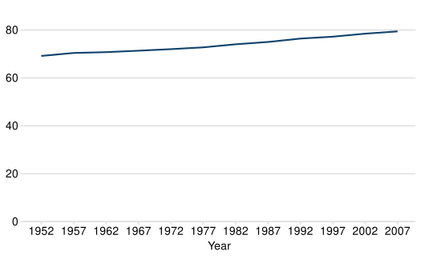

This line chart uses the afcharts theme. There are pale grey grid lines
extending from the y axis, and there is a thicker dark blue line
representing the data.

### Line chart with multiple lines

``` r

gapminder |>
  filter(country %in% c("United Kingdom", "China")) |>
  ggplot(
    aes(
      x = year, y = lifeExp,
      colour = factor(country, levels = c("United Kingdom", "China"))
    )
  ) +
  geom_line(linewidth = 1) +
  theme_af(legend = "right") +
  scale_colour_discrete_af() +
  scale_y_continuous(
    limits = c(0, 82),
    breaks = seq(0, 80, 20),
    expand = expansion(mult = c(0, 0.1))
  ) +
  scale_x_continuous(breaks = seq(1952, 2007, 10)) +
  labs(
    x = "Year",
    y = NULL,
    colour = NULL
  )
```

Living Longer

Life Expectancy in the United Kingdom and China 1952 to 2007

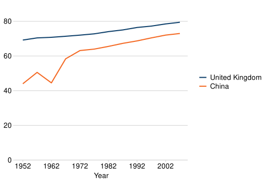

This line chart uses the afcharts theme and there are thin pale grey
lines extending from the y-axis. There are two thicker lines showing the
life expectancy in the UK and China over time. The line colours are from
the Analysis Function categorical2 palette - dark blue for the UK and
orange for China, denoted by a legend at the bottom of the chart.

Legends should be avoided unless absolutely necessary, as these usually
rely on using colour to match labels to data. More information can be
found in the Analysis Function [charts
guidance](https://analysisfunction.civilservice.gov.uk/policy-store/data-visualisation-charts/#section-11).
It is best practice to label lines directly, and an example of this can
be found in the [annotations](#annotations) section.

## Bar charts

``` r

pop_bar_data <- gapminder |>
  filter(year == 2007 & continent == "Americas") |>
  slice_max(order_by = pop, n = 5)
```

``` r

ggplot(pop_bar_data, aes(x = reorder(country, -pop), y = pop)) +
  geom_col(fill = af_colour_values["dark-blue"]) +
  theme_af() +
  scale_y_continuous(
    limits = c(0, 350E6),
    labels = scales::label_number(scale = 1E-6),
    expand = expansion(mult = c(0, 0.1)),
  ) +
  labs(
    x = NULL,
    y = NULL,
  )
```

The U.S.A. is the most populous country in the Americas

Population of countries in the Americas (millions), 2007


This bar chart uses the afcharts theme, and shows the populations of the
five most populous countries in the Americas. Each bar is dark blue and
labelled by country underneath. All text is black in a sans serif font.
Pale grey grid lines extend out from the y axis.

A bar chart can sometimes be easier to interpret with horizontal bars.
This can also be a good option if your bar labels are long and difficult
to display on the x axis. To produce a horizontal bar chart, swap the
variables defined for x and y in
[`aes()`](https://ggplot2.tidyverse.org/reference/aes.html) and make a
few tweaks to
[`theme_af()`](https://best-practice-and-impact.github.io/afcharts/reference/theme_af.md);
draw grid lines for the x axis only by setting the `grid` argument, and
draw an axis line for the y axis only by setting the `axis` argument. We
can also hide the x and y axis titles by setting the `axis_title`
argument. This replaces the need to use the `labs` function, with x and
y set to NULL.

``` r

ggplot(pop_bar_data, aes(x = pop, y = reorder(country, pop))) +
  geom_col(fill = af_colour_values["dark-blue"]) +
  theme_af(grid = "x", axis = "y", axis_title = "none") +
  scale_x_continuous(
    limits = c(0, 350E6),
    labels = scales::label_number(scale = 1E-6),
    expand = expansion(mult = c(0, 0.1))
  )
```

The U.S.A. is the most populous country in the Americas

Population of countries in the Americas (millions), 2007

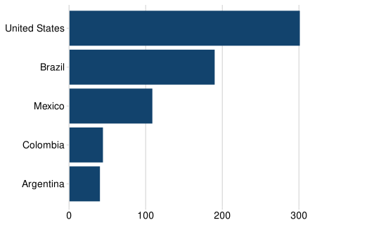

This bar chart uses the afcharts theme and displays the populations of
the five most populous countries in the Americas. The country names are
displayed on the y axis, with the bars extending from left to right.
Each bar is dark blue, and pale grey grid lines extend up from the x
axis.

### Grouped bar chart

To create a grouped bar chart, set `stat = "identity"` and
`position = "dodge"` in the call to
[`geom_bar()`](https://ggplot2.tidyverse.org/reference/geom_bar.html).
Also assign a variable to `fill` within
[`aes()`](https://ggplot2.tidyverse.org/reference/aes.html) to determine
what variable is used to create bars within groups. The `legend`
argument in
[`theme_af()`](https://best-practice-and-impact.github.io/afcharts/reference/theme_af.md)
can be used to set the position of the legend.

``` r

grouped_bar_data <-
  gapminder |>
  filter(
    year %in% c(1967, 2007) &
      country %in% c("United Kingdom", "Ireland", "France", "Belgium")
  )

ggplot(
  grouped_bar_data,
  aes(x = country, y = lifeExp, fill = as.factor(year))
) +
  geom_bar(stat = "identity", position = "dodge") +
  scale_y_continuous(
    limits = c(0, 100),
    breaks = c(seq(0, 100, 20)),
    labels = c(seq(0, 100, 20)),
    expand = expansion(mult = c(0, 0.1))
  ) +
  theme_af(legend = "bottom") +
  scale_fill_discrete_af() +
  labs(
    x = "Country",
    y = NULL,
    fill = NULL
  )
```

Living longer

Difference in life expectancy, 1967 to 2007

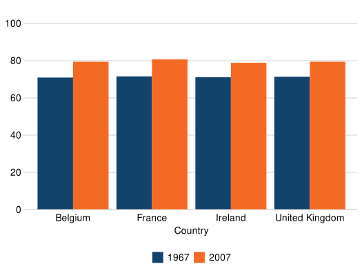

This grouped bar chart uses the afcharts theme. It shows the life
expectancy in 1967 and 2007 for four countries, which are displayed on
the x axis. For each country there are two bars. The bar colours are
from the Analysis Function categorical2 palette - dark blue for 1967 and
orange for 2007, denoted by a legend at the bottom of the chart.

### Stacked bar chart

To create a stacked bar chart, set `stat = "identity` and
`position = "fill"` in the call to
[`geom_bar()`](https://ggplot2.tidyverse.org/reference/geom_bar.html)
and assign a variable to `fill` as before. This will plot your data as
part-to-whole. To plot counts, set `position = "identity"`.

Caution should be taken when producing stacked bar charts. They can
quickly become difficult to interpret if plotting non part-to-whole
data, and/or if plotting more than two categories per stack. First and
last categories in the stack will always be easier to compare across
bars than those in the middle. Think carefully about the story you are
trying to tell with your chart.

``` r

stacked_bar_data <-
  gapminder |>
  filter(year == 2007) |>
  mutate(
    lifeExpGrouped = cut(
      lifeExp,
      breaks = c(0, 75, Inf),
      labels = c("Under 75", "75+")
    )
  ) |>
  group_by(continent, lifeExpGrouped) |>
  summarise(n_countries = n(), .groups = "drop")

ggplot(
  stacked_bar_data,
  aes(x = continent, y = n_countries, fill = lifeExpGrouped)
) +
  geom_bar(stat = "identity", position = "fill") +
  theme_af(legend = "right") +
  scale_y_continuous(
    labels = scales::percent,
    expand = expansion(mult = c(0, 0.1))
  ) +
  coord_cartesian(clip = "off") +
  scale_fill_discrete_af() +
  labs(
    x = NULL,
    y = NULL,
    fill = "Life Expectancy",
  )
```

How life expectancy varies across continents

Percentage of countries by life expectancy band, 2007


This stacked bar chart uses the afcharts theme and shows the proportions
of countries with a life expectancy over and under 75 by continent. The
continents are listed along the x axis, with the y axis labelled between
0% and 100% in breaks of 25%. The colours for the bar segments are from
the Analysis Function categorical2 palette - dark blue for under 75 and
orange for over 75, denoted by a legend at the bottom of the chart.
There is whitespace between each bar.

## Histograms

``` r

gapminder |>
  filter(year == 2007) |>
  ggplot(aes(x = lifeExp)) +
  geom_histogram(
    binwidth = 5,
    colour = "white",
    fill = af_colour_values["dark-blue"]
  ) +
  theme_af() +
  scale_y_continuous(
    limits = c(0, 35),
    breaks = c(seq(0, 35, 5)),
    expand = expansion(mult = c(0, 0.1))
  ) +
  labs(
    x = NULL,
    y = "Number of \ncountries",
  )
```

How life expectancy varies

Distribution of life expectancy, 2007

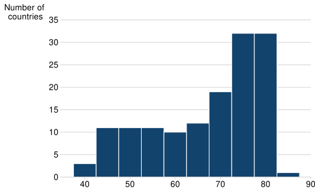

This histogram uses the afcharts theme, and shows the distribution of
life expectancy by number of countries. There are pale grey grid lines
extending out from the y axis. The bars are dark blue with white space
between each.

## Scatterplots

``` r

gapminder |>
  filter(year == 2007) |>
  ggplot(aes(x = gdpPercap, y = lifeExp)) +
  geom_point(colour = af_colour_values["dark-blue"]) +
  theme_af(axis = "none", grid = "xy") +
  scale_x_continuous(labels = scales::label_comma()) +
  labs(
    x = "GDP (US$, inflation-adjusted)",
    y = "Life\nExpectancy\n(years)",
  )
```

The relationship between GDP and Life Expectancy is complex

GDP and Life Expectancy for all countries, 2007

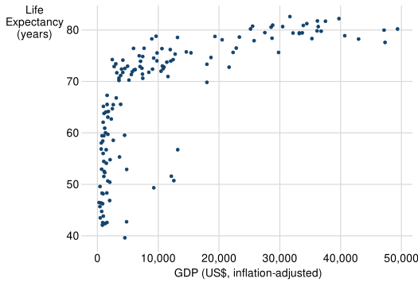

This scatterplot uses the afcharts theme, and shows life expectancy
against GDP for all countries. Thin pale grey lines extend out from the
x and y axis labels, forming a grid. The data points are plotted as dark
blue circles. Both axes are labeled in black using a sans serif font.

It is best practice to use commas to separate thousands. Use
scales::label_comma() to add commas to axis labels.

## Small multiples

``` r

gapminder |>
  filter(continent != "Oceania") |>
  group_by(continent, year) |>
  summarise(pop = sum(as.numeric(pop)), .groups = "drop") |>
  ggplot(aes(x = year, y = pop, fill = continent)) +
  geom_area() +
  theme_af(axis = "none", ticks = "none", legend = "none") +
  scale_fill_discrete_af() +
  facet_wrap(~ continent, ncol = 2, scales = "free_x") +
  scale_x_continuous(
    breaks = c(1952, 2007),
    labels = c("1952", "2007"),
    limits = c(1950, 2010)
  ) +
  scale_y_continuous(
    breaks = c(0, 2e9, 4e9),
    labels = c(0, "2bn", "4bn")
  ) +
  coord_cartesian(clip = "off") +
  labs(
    x = NULL,
    y = NULL
  )
```

Asia’s rapid growth

Population growth in billions by continent, 1952 to 2007

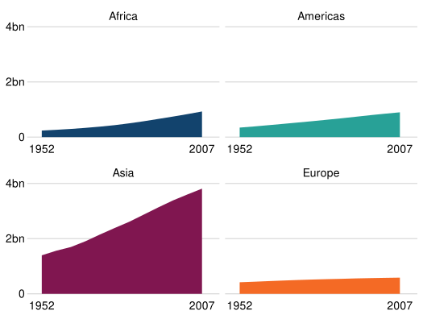

This chart uses the afcharts theme. It contains four subplots in a two
by two grid showing how the populations of four continents have changed
over time. Each subplot is labelled with the continent. The subplots
have a common y axis, with no values on the x axis to facilitate for a
simple comparison of the relative values. Each subplot is filled with a
different colour from the Analysis Function categorical colour palette
to be distinct from other subplots.

## Pie charts

``` r

stacked_bar_data |>
  filter(continent == "Europe") |>
  ggplot(aes(x = "", y = n_countries, fill = lifeExpGrouped)) +
  geom_col(colour = "white", position = "fill") +
  coord_polar(theta = "y") +
  theme_af(grid = "none", axis = "none", ticks = "none") +
  theme(axis.text = element_blank()) +
  scale_fill_discrete_af() +
  labs(
    x = NULL,
    y = NULL,
    fill = NULL,
  )
```

How life expectancy varies in Europe

Percentage of countries by life expectancy band, 2007

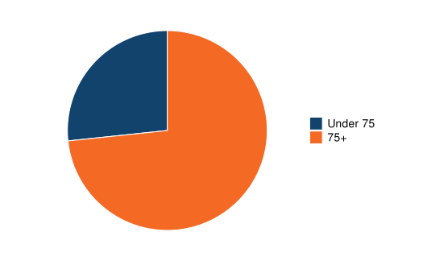

This pie chart uses the afcharts theme, showing the proportions of
European countries with a life expectancy under and over 75. The segment
colours are from the Analysis Function categorical2 palette, with the
smaller under 75 segment in dark blue, and the larger over 75 segment in
orange. This is indicated by a legend to the right of the pie chart.
There is whitespace separating the segments from each other.

## Focus charts

``` r

pop_bar_data |>
  ggplot(aes(x = reorder(country, -pop), y = pop, fill = country == "Brazil")) +
  geom_col() +
  theme_af(legend = "none") +
  scale_y_continuous(
    limits = c(0, 350E6),
    labels = scales::label_number(scale = 1E-6),
    expand = expansion(mult = c(0, 0.1))
  ) +
  scale_fill_discrete_af("focus", reverse = TRUE) +
  labs(
    x = NULL,
    y = NULL,
  )
```

Brazil has the second highest population in the Americas

Population of countries in the Americas (millions), 2007

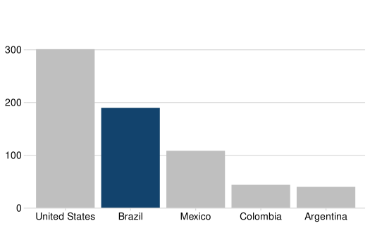

This bar chart uses the afcharts theme, and shows the populations of
five countries of the Americas in descending order. The country names
are given on the x axis, with all chart text in black in a sans serif
font. Four of the bars on the chart are light grey, and the bar for
Brazil is filled in dark blue to highlight it.

## Interactive charts

To make a `ggplot2` chart interactive, use `ggplotly()` from the
`plotly` package. Note however that `ggplotly()` has a number of
‘quirks’, including the following:

- afcharts uses the ‘sans’ font family, however `plotly` does not
  recognise this font. To work around this you should add a further call
  to `theme` to set the font family for text to `""`.

- Subtitles and captions are not supported in `ggplotly()`. As stated
  elsewhere in this guidance, titles and subtitles should ideally be
  included in the body of text surrounding a chart rather than embedded
  in the chart itself, and so this is hopefully not a big issue.

Please note, interactive charts may not meet all accessibility
requirements and we advise you to test any interactive charts with users
to ensure they work correctly.

``` r

p <-
  pop_bar_data |>
  # Format text for tooltips
  mutate(
    tooltip = paste0(
      "Country: ", country, "\n",
      "Population (millions): ", round(pop / 10 ^ 6, 1)
    )
  ) |>
  ggplot(aes(x = reorder(country, -pop), y = pop, text = tooltip)) +
  geom_col(fill = af_colour_values["dark-blue"]) +
  theme_af(ticks = "x") +
  theme(text = element_text(family = "")) +
  scale_y_continuous(
    limits = c(0, 350E6),
    labels = scales::label_number(scale = 1E-6),
    expand = expansion(mult = c(0, 0.1))
  ) +
  labs(
    x = NULL,
    y = NULL
  )

plotly::ggplotly(p, tooltip = "text") |>
  plotly::config(
    modeBarButtons = list(list("resetViews")),
    displaylogo = FALSE
  )
```

The U.S.A. is the most populous country in the Americas

Population of countries in the Americas (millions), 2007

This is an interactive bar chart using the afcharts theme, showing the
populations of the five most populous countries in the Americas. The
bars are dark blue. A tooltip appears when hovering over each bar with
the cursor, which shows a matching dark blue box with the country and
population displayed in white text. Click and drag on the chart using
the cursor to zoom in on the selected area. Click the ‘home’ icon in the
top right corner to reset the view.

## Annotations

Labelling your chart is often preferable to using a legend, as often
this relies on a user matching the legend to the data using colour
alone. The legend can be removed from a chart by setting
`legend = "none"` in
[`theme_af()`](https://best-practice-and-impact.github.io/afcharts/reference/theme_af.md).

The easiest way to add an annotation is to manually define the
co-ordinates of the required position. Note that black text has been
used for the labels, as this ensures sufficient contrast against the
white background.

``` r

ann_data <- gapminder |>
  filter(country %in% c("United Kingdom", "China")) |>
  mutate(country = factor(country, levels = c("United Kingdom", "China")))
```

``` r

ann_data |>
  ggplot(aes(x = year, y = lifeExp)) +
  geom_line(
    aes(colour = country),
    linewidth = 1
  ) +
  theme_af(legend = "none") +
  scale_colour_discrete_af() +
  scale_y_continuous(
    limits = c(0, 82),
    breaks = seq(0, 80, 20),
    expand = expansion(mult = c(0, 0.1))
  ) +
  scale_x_continuous(
    limits = c(1952, 2017),
    breaks = seq(1952, 2017, 10)
  ) +
  annotate(
    geom = "label",
    x = 2008, y = 73,
    label = "China",
    linewidth = NA,
    hjust = 0,
    vjust = 0.5
  ) +
  annotate(
    geom = "label",
    x = 2008,
    y = 79.4,
    label = "United Kingdom",
    linewidth = NA,
    hjust = 0,
    vjust = 0.5
  ) +
  labs(
    x = "Year",
    y = NULL,
  )
```

Living Longer

Life Expectancy in the United Kingdom and China 1952 to 2007

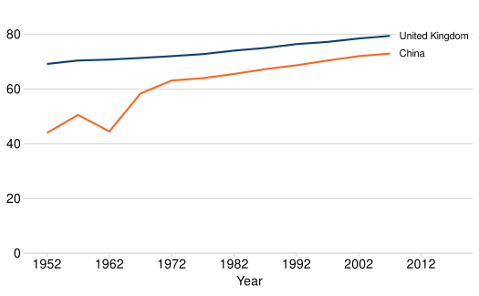

The line chart uses the afcharts theme, and has one blue and one orange
line. These are each labelled with a sans serif font in black at the end
of the line.

However, this code is difficult to reuse as the annotation position
values are hard coded and not automatically generated from the data.
Automating the position of annotations is possible, but more fiddly.

The following examples use
[`geom_label()`](https://ggplot2.tidyverse.org/reference/geom_text.html)
to use values from the data to position annotations.
[`geom_label()`](https://ggplot2.tidyverse.org/reference/geom_text.html)
draws a rectangle behind the text (white by default) and a border the
same colour as the text (`linewidth = NA` can be used to remove the
border).
[`geom_text()`](https://ggplot2.tidyverse.org/reference/geom_text.html)
is also an option for annotations, but this does not include a
background and so can be harder for text to read if it overlaps with
other chart elements. These functions also have `nudge` arguments that
can be used to displace text to improve the positioning.

Note that in the previous examples,
[`annotate()`](https://ggplot2.tidyverse.org/reference/annotate.html)
also requires a geom (`label` or `text`). These operate in the same way
as
[`geom_label()`](https://ggplot2.tidyverse.org/reference/geom_text.html)
and
[`geom_text()`](https://ggplot2.tidyverse.org/reference/geom_text.html),
but as discussed,
[`annotate()`](https://ggplot2.tidyverse.org/reference/annotate.html) is
only able to deal with fixed values.

``` r

ann_labs <- ann_data |>
  group_by(country) |>
  mutate(min_year = min(year)) |>
  filter(year == max(year)) |>
  ungroup()

ann_data |>
  ggplot(aes(x = year, y = lifeExp)) +
  geom_line(
    aes(colour = country),
    linewidth = 1
  ) +
  theme_af(legend = "none") +
  scale_colour_discrete_af() +
  scale_y_continuous(
    limits = c(0, 82),
    breaks = seq(0, 80, 20),
    expand = expansion(mult = c(0, 0.1))
  ) +
  scale_x_continuous(
    limits = c(1952, 2017),
    breaks = seq(1952, 2017, 10)
  ) +
  geom_label(
    data = ann_labs,
    aes(x = year, y = lifeExp, label = country),
    hjust = 0,
    vjust = 0.5,
    nudge_x = 0.5,
    linewidth = NA
  ) +
  labs(
    x = "Year",
    y = NULL,
  )
```

Living Longer

Life Expectancy in the United Kingdom and China 1952 to 2007

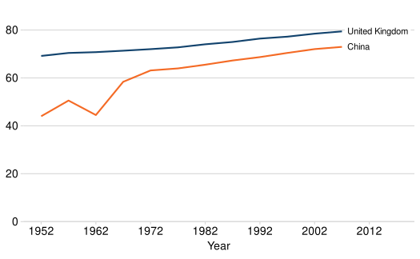

The line chart uses the afcharts theme and appears highly similar to the
previous plot. It has one blue and one orange line with each labelled
with a sans serif font in black at the end of the line.

Annotations may also be used to add value labels to a bar chart. Note
that
[`geom_text()`](https://ggplot2.tidyverse.org/reference/geom_text.html)
is used here as a background is not required.

``` r

ggplot(pop_bar_data, aes(x = reorder(country, -pop), y = pop)) +
  geom_col(fill = af_colour_values["dark-blue"]) +
  geom_text(
    aes(label = round(pop / 1E6, 1)),
    vjust = 1.2,
    colour = "white"
  ) +
  theme_af() +
  scale_y_continuous(
    limits = c(0, 350E6),
    labels = scales::label_number(scale = 1E-6),
    expand = expansion(mult = c(0, 0.1))
  ) +
  labs(
    x = NULL,
    y = NULL
  )
```

The U.S.A. is the most populous country in the Americas

Population of countries in the Americas (millions), 2007

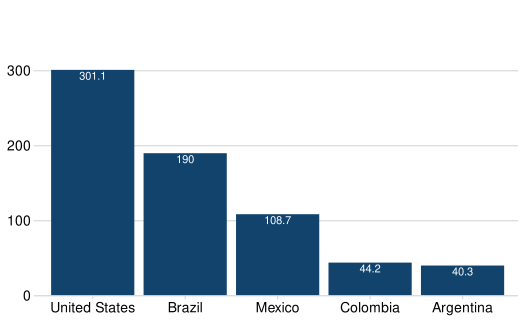

This bar chart uses the afcharts theme. All the bars are dark blue and
have white text labels at the top of each bar showing the y axis value.

**Note**: The
[`annotate()`](https://ggplot2.tidyverse.org/reference/annotate.html)
function should be used to add annotations with manually defined
positioning co-ordinates, whereas
[`geom_label()`](https://ggplot2.tidyverse.org/reference/geom_text.html)
and
[`geom_text()`](https://ggplot2.tidyverse.org/reference/geom_text.html)
should be used when using co-ordinates defined in a data frame. Although
the reverse may work, text can appear blurry.

## Other customisations

[`theme_af()`](https://best-practice-and-impact.github.io/afcharts/reference/theme_af.md)
has arguments to control the legend position and appearance of grid
lines, axis lines and axis ticks. More information on accepted values
can be found in the [help
file](https://best-practice-and-impact.github.io/afcharts/reference/theme_af.html).

### Sorting a bar chart

To control the order of bars in a chart, wrap the variable you want to
arrange with [`reorder()`](https://rdrr.io/r/stats/reorder.factor.html)
and specify what variable you want to sort by. The following example
sorts bars in ascending order of population from the bottom of the chart
up. To sort in descending order, you would change this to
`reorder(country, desc(pop))`.

``` r

population_chart <- pop_bar_data |>
  ggplot(aes(x = pop, y = reorder(country, pop))) +
  geom_col(fill = af_colour_values["dark-blue"]) +
  theme_af(axis = "y", grid = "x") +
  labs(
    x = NULL,
    y = NULL
  )
print(population_chart)
```

The U.S.A. is the most populous country in the Americas

Population of countries in the Americas (millions), 2007

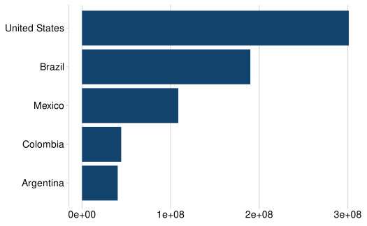

This bar chart uses the afcharts theme and shows the population of five
countries. The country names are given on the y axis, with the bars
extending from left to right, sorted by values decreasing from the top
down. All the bars are in dark blue, and there is a small white gap
between the bars and the y axis. The x axis values are given in
exponential notation.

Examples in the following sections iterate on this chart.

### Reducing space between chart and axis

By default, a bar chart will have a gap between the bottom of the bars
and the axis. This can be removed as follows:

``` r

last_plot() +
  scale_x_continuous(expand = expansion(mult = c(0, 0.1)))
```

The U.S.A. is the most populous country in the Americas

Population of countries in the Americas (millions), 2007

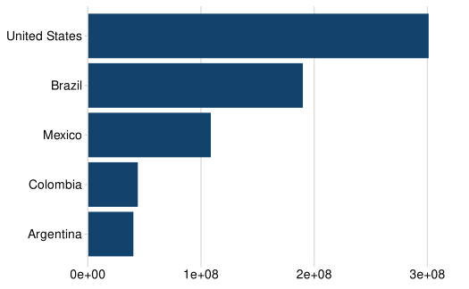

This horizontal bar chart uses the afcharts theme. It shows the
populations of five countries, with country names given on the y axis.
All the bars are in dark blue and against the y axis. The x axis values
are given in exponential notation.

The equivalent adjustment can be made for the y axis using
[`scale_y_continuous()`](https://ggplot2.tidyverse.org/reference/scale_continuous.html).

### Changing axis limits, breaks and labels

Axis limits, breaks and labels for continuous variables can be
controlled using `scale_x/y_continuous()`. For discrete variables,
labels can be changed using `scale_x/y_discrete()` or alternatively by
recoding the variable in the data before creating a chart.

Limits, breaks and labels can be defined with custom values.

``` r

last_plot() +
  scale_x_continuous(
    breaks = seq(0, 400E6, 100E6),
    labels = seq(0, 400, 100),
    limits = c(0, 420E6),
    expand = expansion(mult = c(0, 0.1))
  ) +
  labs(
    x = "Population (millions)"
  )
```

The U.S.A. is the most populous country in the Americas

Population of countries in the Americas (millions), 2007

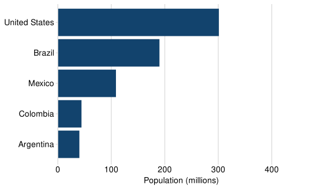

This horizonal bar chart uses the afcharts theme and shows the
populations of five countries. The country names are given on the y
axis, and all the bars are in blue. The x axis is labeled every 100 from
zero to 400. The x axis label indicates that population is reported in
millions.

Adaptive axis limits and break for `scale_x/y_continuous()` can be
defined using the [`pretty()`](https://rdrr.io/r/base/pretty.html)
function. This defines breaks that are equally spaced ‘round’ values
which cover the range of the data and limits that are the next ‘round’
value just exceeding the range of the data. Setting the limits manually
based on the range of the calculated breaks ensures the highest gridline
value is above the maximum value of the data.

``` r


breaks_pretty <- pretty(pop_bar_data$pop)
limits_pretty <- range(breaks_pretty)

last_plot() +
  scale_x_continuous(
    breaks = breaks_pretty,
    labels = label_number(scale = 1E-6),
    limits = limits_pretty,
    expand = expansion(mult = c(0, 0.2))
  ) +
  labs(
    x = "Population (millions)"
  )
```

The U.S.A. is the most populous country in the Americas

Population of countries in the Americas (millions), 2007

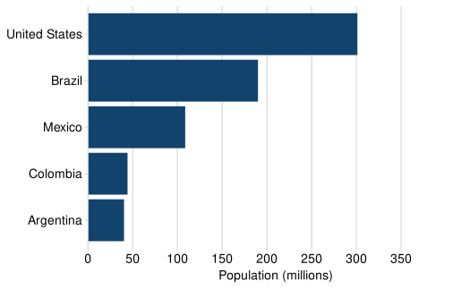

This horizonal bar chart uses the afcharts theme and shows the
populations of five countries. The country names are given on the y
axis, and all the bars are in blue. The x axis is labeled every 50 from
zero to 350. The x axis label indicates that population is reported in
millions.

### Formatting labels

Formatting axis labels or legend labels is easily handled using the
`scales` package. The following example formats y axis labels as
percentages, however `scales` can also handle currency and thousands
separators.

``` r

stacked_bar_data |>
  ggplot(aes(x = continent, y = n_countries, fill = lifeExpGrouped)) +
  geom_bar(stat = "identity", position = "fill") +
  theme_af(legend = "right") +
  scale_y_continuous(
    expand = expansion(mult = c(0, 0.1)),
    labels = scales::percent
  ) +
  scale_fill_discrete_af() +
  labs(
    x = NULL,
    y = NULL,
    fill = "Life Expectancy"
  )
```

How life expectancy varies across continents

Percentage of countries by life expectancy band, 2007

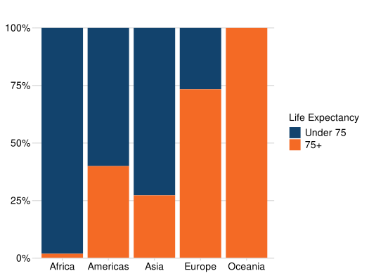

This stacked bar uses the afcharts theme. The y axis is labelled every
25 from 0 to 100 percent, with light grey grid lines and tick marks
going horizontally from the y axis.

### Avoiding axis/grid lines being cut off

Axis lines and grid lines can sometimes appear ‘cut off’ if they are
drawn at the limits of the chart range. In the previous plot, the top
grid line is slightly narrower than the adjacent tick mark on the y
axis. This is because the y axis limit is 100%. As the grid line is
centred at 100%, the top half of the line is ‘cut off’. This can be
corrected as follows:

``` r

last_plot() + coord_cartesian(clip = "off")
```

How life expectancy varies across continents

Percentage of countries by life expectancy band, 2007


This is a stacked bar chart with the afcharts theme, where the top
gridline is the same width as the adjoining tick mark and other grid
lines.

### Adding a line

To add a horizontal or vertical line across the whole plot, use
[`geom_hline()`](https://ggplot2.tidyverse.org/reference/geom_abline.html)
or
[`geom_vline()`](https://ggplot2.tidyverse.org/reference/geom_abline.html).
This can be useful to highlight a threshold or average level.

``` r

gapminder |>
  filter(country == "United Kingdom") |>
  ggplot(aes(x = year, y = lifeExp)) +
  geom_line(linewidth = 1, colour = af_colour_values[1]) +
  geom_hline(
    yintercept = 75,
    colour = "#7F7F7F",
    linewidth = 1,
    linetype = "dashed"
  ) +
  annotate(geom = "text", x = 2007, y = 70, label = "Age 70") +
  theme_af() +
  scale_y_continuous(
    limits = c(0, 82),
    breaks = seq(0, 80, 20),
    expand = expansion(mult = c(0, 0.1))
  ) +
  scale_x_continuous(breaks = seq(1952, 2007, 5)) +
  labs(
    x = "Year",
    y = NULL
  )
```

Living Longer

Life Expectancy in the United Kingdom 1952 to 2007

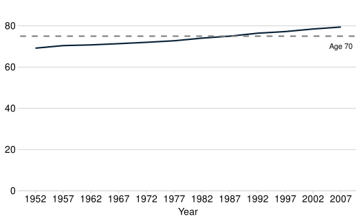

This line chart uses the afcharts theme. There is a solid dark blue line
trending upwards, and a dashed teal line horizontal to 75 on the y-axis.
There are also pale grey grid lines extending from regular intervals on
the y axis.

### Embedding chart titles

As mentioned previously, chart titles, subtitles, and captions should be
included as titles or the main body of the text where possible for
accessibility purposes. However, these can embedded into the chart image
with [`labs()`](https://ggplot2.tidyverse.org/reference/labs.html) if
required. A title can be removed using `NULL`.

``` r

population_chart +
  labs(
    x = NULL,
    y = NULL,
    title = stringr::str_wrap(
      paste("The U.S.A. has the highest population in the Americas"),
      width = 40
    ),
    subtitle = "Population of countries of the Americas (millions), 2007",
    caption = "Source: Gapminder"
  )
```

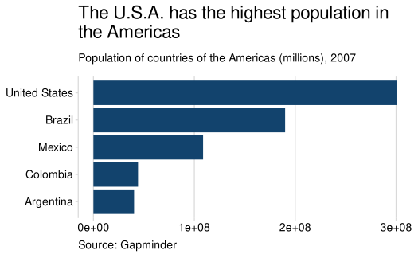

In the bar chart image, the title gives a data insight and is presented
in large bold text at the top. This is followed by smaller text giving a
brief description of the data. In the bottom left of the image is a data
citation as a caption.

The y-axis title should be horizontal, not vertical. The position can
sometimes look odd, especially for longer titles. You can use the plot
subtitle as a description of the y-axis and set the y-axis title to
`NULL`.

``` r


ggplot(pop_bar_data, aes(x = reorder(country, -pop), y = pop)) +
  geom_col(fill = af_colour_values["dark-blue"]) +
  theme_af() +
  scale_y_continuous(
    limits = c(0, 350E6),
    labels = scales::label_number(scale = 1E-6),
    expand = expansion(mult = c(0, 0.1)),
  ) +
  labs(
    x = NULL,
    y = "Population (millions)",
    title = stringr::str_wrap(
      "The U.S.A. is the most populous country in the Americas",
      35
    ),
    caption = "Source: Gapminder"
  )
```

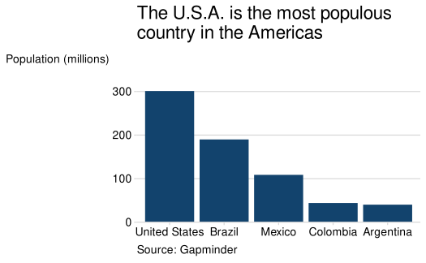

In this bar chart image, the y-axis title, “Population (millions)”, is
to the left of the top of the y-axis.

``` r


ggplot(pop_bar_data, aes(x = reorder(country, -pop), y = pop)) +
  geom_col(fill = af_colour_values["dark-blue"]) +
  theme_af() +
  scale_y_continuous(
    limits = c(0, 350E6),
    labels = scales::label_number(scale = 1E-6),
    expand = expansion(mult = c(0, 0.1)),
  ) +
  labs(
    x = NULL,
    y = NULL,
    title = stringr::str_wrap(
      "The U.S.A. is the most populous country in the Americas",
      40
    ),
    subtitle = "Population (millions)",
    caption = "Source: Gapminder"
  )
```

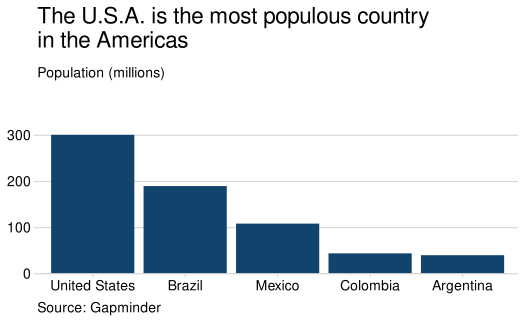

In this bar chart image, the y-axis title, “Population (millions)”, is
above and to the right of the y-axis.

### Wrapping text

If text is too long, it may be cut off or distort the dimensions of the
chart.

``` r

plot <-
  ggplot(pop_bar_data, aes(x = reorder(country, -pop), y = pop)) +
  geom_col(fill = af_colour_values["dark-blue"]) +
  theme_af() +
  scale_y_continuous(labels = label_number(scale = 1E-6),
                     expand = expansion(mult = c(0, 0.1))) +
  labs(
    x = NULL,
    subtitle = "Population of countries in the Americas, 2007",
    caption = "Source: Gapminder"
  )

plot +
  labs(
    y = "Population in millions",
    title = paste("The U.S.A. is the most populous country in ",
                  "the Americas")
  )
```

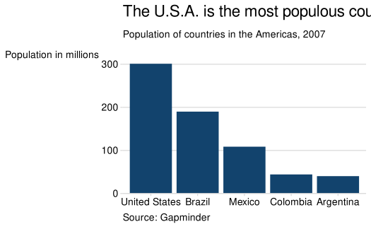

In this bar chart image, the title text is being cut off with only part
of the text appearing in the image.

There are two suggested ways to solve this issue; Insert `\n` within a
string to force a line break; Use
[`stringr::str_wrap()`](https://stringr.tidyverse.org/reference/str_wrap.html)
to set a maximum character width of the string. See examples of both of
these methods as follows:

``` r

plot +
  labs(
    y = "Population\nin millions",
    title = stringr::str_wrap(
      paste("The U.S.A. is the most populous country in ",
            "the Americas"),
      width = 40
    )
  )
```

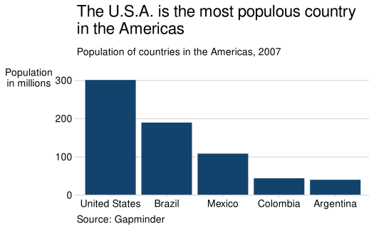

In this bar chart image, the y-axis label and chart title text have been
wrapped onto two lines so that all the text is visible.

### Adjusting theme elements

If you find you need to adjust theme elements for your chart, this can
be done using
[`theme()`](https://ggplot2.tidyverse.org/reference/theme.html). Note
that this should be done after the call to
[`theme_af()`](https://best-practice-and-impact.github.io/afcharts/reference/theme_af.md),
otherwise
[`theme_af()`](https://best-practice-and-impact.github.io/afcharts/reference/theme_af.md)
may overwrite the specifications you’ve made.

``` r

ggplot(pop_bar_data, aes(x = reorder(country, -pop), y = pop)) +
  geom_col(fill = af_colour_values["dark-blue"]) +
  theme_af(axis = "xy") +
  theme(
    axis.line = element_line(colour = "black"),
    axis.ticks = element_line(colour = "black")
  ) +
  scale_y_continuous(
    expand = expansion(mult = c(0, 0.1)),
    limits = c(0, 350E6),
    labels = scales::label_number(scale = 1E-6)
  ) +
  labs(
    x = NULL,
    y = NULL
  )
```

The U.S.A. is the most populous country in the Americas

Population of countries in the Americas (millions), 2007

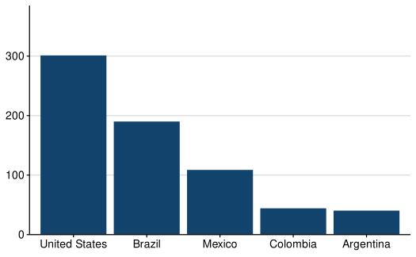

This bar chart uses the afcharts theme. The bars are dark blue, with
axis lines and ticks coloured black as opposed to the default `theme_af`
grey.

You may also consider using markdown or HTML formatted text within your
charts. This can be readily achieved with
[`ggtext::element_markdown()`](https://wilkelab.org/ggtext/reference/element_markdown.html).

``` r

ann_data <- gapminder |>
  filter(country %in% c("United Kingdom", "China")) |>
  mutate(country = factor(country, levels = c("United Kingdom", "China")))

ann_labs <- ann_data |>
  group_by(country) |>
  mutate(min_year = min(year)) |>
  filter(year == max(year)) |>
  ungroup()

ann_data |>
  ggplot(aes(x = year, y = lifeExp, colour = country)) +
  geom_line(linewidth = 1) +
  theme_af(legend = "none") +
  scale_colour_discrete_af() +
  scale_y_continuous(
    limits = c(0, 82),
    breaks = seq(0, 80, 20),
    expand = expansion(mult = c(0, 0.1))
  ) +
  scale_x_continuous(
    limits = c(1952, 2017),
    breaks = seq(1952, 2017, 10)
  ) +
  geom_label(
    data = ann_labs,
    aes(x = year, y = lifeExp, label = country),
    size = 4.5,
    hjust = 0,
    vjust = 0.5,
    nudge_x = 0.5,
    linewidth = NA
  ) +
  coord_cartesian(clip = "off") +
  labs(
    x = "Year",
    y = NULL,
    title = "Living Longer",
    subtitle = "Life Expectancy in years in the
    <span style='color:#12436D;'>United Kingdom</span> and
    <span style='color:#F46A25;'>China</span> 1952 to 2007",
    caption = "Source: Gapminder"
  ) +
  theme(plot.subtitle = element_markdown())
```

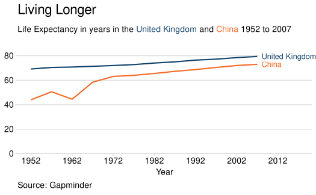

In this line chart image, the word ‘China’ and ‘United Kingdom’ in the
subtitle and label text have been set to correspond to their line
colours. Please refer to [Analysis Function
guidance](https://analysisfunction.civilservice.gov.uk/policy-store/data-visualisation-charts/)
in considering the accessibility of custom formatting, such as when
using colours.

## Using different colour palettes

afcharts provides colour palettes as set out by the [Government Analysis
Function suggested colour
palettes](https://analysisfunction.civilservice.gov.uk/policy-store/data-visualisation-colours-in-charts/#section-4).
These palettes have been developed to meet the [Web Content
Accessibility Guidelines 2.1 for graphical
objects](https://www.w3.org/WAI/WCAG21/Understanding/non-text-contrast.html).

The [categorical
palette](https://best-practice-and-impact.github.io/afcharts/articles/colours.html#main-palette)
is the default for discrete colour/fill functions, and the [sequential
palette](https://best-practice-and-impact.github.io/afcharts/articles/colours.html#sequential-palette)
for continuous colour/fill functions.

More information on the colours used in afcharts can be found at
[`vignette("colours")`](https://best-practice-and-impact.github.io/afcharts/articles/colours.md).

### Using afcharts colour palettes

The full list of available palettes can be found by running
[`afcharts::af_colour_palettes`](https://best-practice-and-impact.github.io/afcharts/reference/af_colour_palettes.md).

For example, to use the Analysis Function `categorical2` palette:

``` r

gapminder |>
  filter(country %in% c("United Kingdom", "China")) |>
  ggplot(
    aes(
      x = year, y = lifeExp,
      colour = factor(country, levels = c("United Kingdom", "China"))
    )
  ) +
  geom_line(linewidth = 1) +
  theme_af(legend = "right") +
  scale_colour_discrete_af("categorical2") +
  scale_y_continuous(
    limits = c(0, 82),
    breaks = seq(0, 80, 20),
    expand = c(0, 0)
  ) +
  scale_x_continuous(breaks = seq(1952, 2007, 10)) +
  labs(
    x = "Year",
    y = NULL,
    colour = NULL
  )
```

Living Longer

Life Expectancy in the United Kingdom and China 1952 to 2007

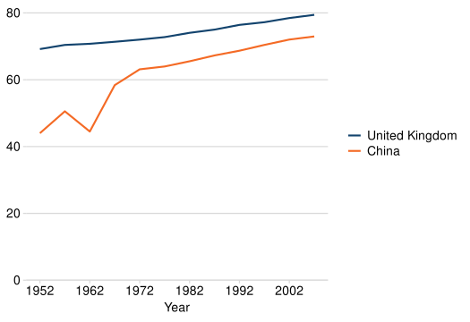

This line chart uses the afcharts theme and the Analysis Function
categorical2 palette, with one line in dark blue and one in orange.

### Using your own colour palette

There may be instances where you’d like to use a colour palette that is
not available in afcharts. If so, this should be carefully considered to
ensure it meets accessibility requirements. The Government Analysis
Function guidance outlines [appropriate steps for choosing your own
accessible colour
palette](https://analysisfunction.civilservice.gov.uk/policy-store/data-visualisation-colours-in-charts/#section-9)
and should be used.

``` r

my_palette <- c("#0F820D", "#000000")

gapminder |>
  filter(country == "United Kingdom") |>
  ggplot(aes(x = year, y = lifeExp)) +
  geom_line(linewidth = 1, colour = my_palette[1]) +
  theme_af() +
  scale_y_continuous(
    limits = c(0, 82),
    breaks = seq(0, 80, 20),
    expand = c(0, 0)
  ) +
  scale_x_continuous(breaks = seq(1952, 2007, 10)) +
  labs(
    x = "Year",
    y = NULL,
  )
```

Living Longer

Life Expectancy in the United Kingdom 1952 to 2007

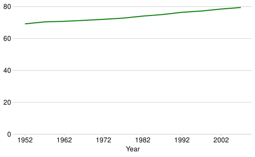

This line chart uses the afcharts theme with a single green line.

Alternatively, you may wish to use multiple custom colours:

``` r

gapminder |>
  filter(country %in% c("United Kingdom", "China")) |>
  ggplot(
    aes(
      x = year, y = lifeExp,
      colour = factor(country, levels = c("United Kingdom", "China"))
    )
  ) +
  geom_line(linewidth = 1) +
  theme_af(legend = "right") +
  scale_colour_manual(values = rev(my_palette)) +
  scale_y_continuous(
    limits = c(0, 82),
    breaks = seq(0, 80, 20),
    expand = c(0, 0)
  ) +
  scale_x_continuous(breaks = seq(1952, 2007, 10)) +
  labs(
    x = "Year",
    y = NULL,
    colour = NULL
  )
```

Living Longer

Life Expectancy in the United Kingdom and China 1952 to 2007

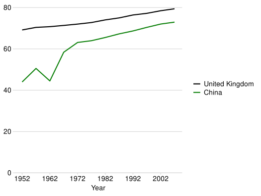

This line chart uses the afcharts theme. One line is green and the other
is black.

#### Adding a new colour palette to afcharts

If you use a different palette regularly and feel it would be useful for
this to be added to afcharts, please make a suggestion as per the
[contributing
guidance](https://best-practice-and-impact.github.io/afcharts/CONTRIBUTING.html).

## Acknowledgments

The afcharts package is based on the
[sgplot](https://scotgovanalysis.github.io/sgplot/index.html) package,
written by Alice Hannah.

This cookbook and the examples it contains have been inspired by the
[BBC Visual and Data Journalism cookbook for R
graphics](https://bbc.github.io/rcookbook/) and their
[bbplot](https://github.com/bbc/bbplot) package.

The data used throughout the cookbook is from
[gapminder](https://CRAN.R-project.org/package=gapminder).
